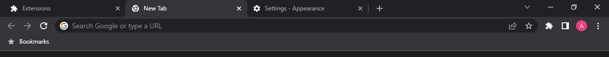

<h1 align="center"><strong>Simple Dark.</strong></h1>
<h3>A dark theme for Google Chrome.</h3>

## Installation
Go to [the releases](https://github.com/adibarra/simple-dark/releases) and download the latest version of the theme.

Then, go to [`chrome://extensions`](chrome://extensions) and drag the downloaded file into the page. The theme will be automatically installed.
